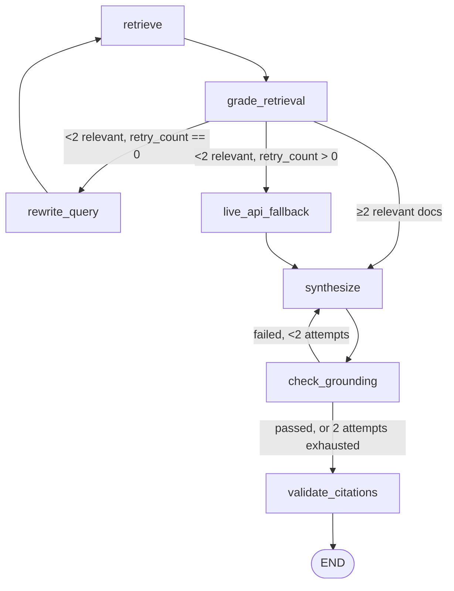

# System Design

## Goals

Answer research questions about academic papers with:
- **Grounded answers** — every claim traceable to a retrieved source.
- **Verifiable citations** — citations checked deterministically, not just trusted from the LLM.
- **Self-correction** — if retrieval comes back weak, the system rewrites the query or reaches
  out to a live API before giving up, instead of answering from a poor context.
- **Transparency** — the full reasoning trace (retrieval, grading, rewriting, fallback,
  synthesis, verification) is surfaced to the end user, not hidden.

## High-level architecture

```
┌─────────────┐      ┌──────────────┐      ┌───────────────────────┐
│  Streamlit   │ ───► │   FastAPI    │ ───► │   LangGraph agent     │
│  UI (ui/)    │ ◄─── │  (api/main)  │ ◄─── │   (agents/graph.py)   │
└─────────────┘      └──────────────┘      └───────────┬───────────┘
                                                          │
                     ┌────────────────────────────────────┼────────────────────────┐
                     │                                     │                        │
             ┌───────▼────────┐                  ┌─────────▼─────────┐   ┌──────────▼─────────┐
             │ Hybrid Retriever│                  │   LLM Provider     │   │   OpenAlex API      │
             │ (BM25 + Qdrant) │                  │ (llm/provider.py)  │   │ (live fallback +    │
             └───────┬─────────┘                  └────────────────────┘   │  ingestion)         │
                     │                                                     └─────────────────────┘
             ┌───────▼─────────┐
             │  Qdrant (vector) │
             └──────────────────┘
```

The UI and API communicate over plain HTTP (`POST /ask`). The API is a thin wrapper: it builds
the initial LangGraph state, invokes the compiled graph, and reshapes the final state into the
response schema. All the actual logic — retrieval, grading, rewriting, synthesis, validation —
lives inside the graph's nodes.

## Data ingestion

`ingestion/openalex.py` talks to the OpenAlex `/works` endpoint:

- `fetch_papers(topics, max_per_topic)` — cursor-paginated bulk fetch, filtered with
  `title_and_abstract.search:{topic}` (OpenAlex deprecated filtering by `concepts.display_name`,
  so free-text search is used instead). Used for bulk ingestion.
- `search_live(query, per_page)` — a single-page `search=` query, used only by the agent's
  `live_api_fallback` node when normal retrieval fails twice.

Both reconstruct the abstract from OpenAlex's `abstract_inverted_index` (a word → positions map,
used by OpenAlex instead of storing plain text) and skip any work with no abstract.

`ingestion/chunker.py` turns raw paper dicts into retrieval-ready documents:

- `prepare_documents(papers)` — builds `page_content` (`"{title}. {abstract}"`) and a metadata
  dict (`openalex_id`, `title`, `authors`, `cited_by_count`, `publication_year`, `concepts`,
  `doi`, `oa_url`), with `authors`/`concepts` flattened to comma-separated strings.
- `embed_and_upsert(documents)` — embeds `page_content` in batches of 64 with
  `sentence-transformers` (`all-MiniLM-L6-v2`, 384-dim), creates the Qdrant collection
  (`Cosine` distance) if it doesn't exist, and upserts points with the full metadata as payload.

## Retrieval: hybrid search + RRF

`retrieval/hybrid.py`'s `HybridRetriever` combines two independent retrieval signals:

- **BM25** (`rank_bm25.BM25Okapi`) — a whitespace-tokenized in-memory index built from the same
  corpus that was embedded into Qdrant. `build_bm25(documents)` builds and persists it (as JSON:
  the raw corpus + documents, not the index object itself — BM25Okapi is cheap to rebuild from
  tokenized text, so only the source data needs to survive a restart). The constructor loads this
  JSON automatically if present, so a fresh `HybridRetriever()` doesn't require rebuilding.
- **Vector search** — the same embedding model queries Qdrant via `query_points`.

Results from both are merged with **Reciprocal Rank Fusion**:

```
score(doc) = Σ 1 / (60 + rank)   summed over every result list the doc appears in (rank is 1-based)
```

Merging is keyed on `metadata["openalex_id"]`, since that's the one identifier both a BM25 corpus
index and a Qdrant payload independently agree on. Each result returned by `search()` carries a
`sources` list (`["bm25"]`, `["vector"]`, or both) so the caller/UI can see which retrieval path
actually surfaced it.

## The Corrective RAG agent

`agents/graph.py` compiles a `langgraph.graph.StateGraph` — the state schema, nodes, and routing
logic are all here; `agents/nodes.py` holds the node implementations.

### State

| Field | Type | Purpose |
|---|---|---|
| `query` | `str` | original user question |
| `rewritten_query` | `str \| None` | set once `rewrite_query` runs |
| `retrieved_docs` | `list[dict]` | raw hybrid search results |
| `graded_docs` | `list[dict]` | docs that passed relevance grading |
| `generation` | `str \| None` | synthesized answer |
| `citations` | `list[str]` | OpenAlex IDs the answer actually cites |
| `agent_trace` | `list[str]` | human-readable log of every step, shown in the UI |
| `fallback_used` | `bool` | whether `live_api_fallback` ran |
| `grounding_passed` | `bool` | result of the last `check_grounding` |
| `citation_validated` | `bool` | result of `validate_citations` |
| `retry_count` | `int` | how many times `rewrite_query` has run |

### Flow



### Nodes (`agents/nodes.py`)

- **`retrieve`** — runs `HybridRetriever.search()` on `rewritten_query` if set, else `query`.
- **`grade_retrieval`** — for each retrieved doc, asks the LLM `{"relevant": bool, "reason": str}`
  and keeps only the docs graded relevant (`retrieval/grader.py`, one call per doc).
- **`rewrite_query`** — asks the LLM to rewrite the query for better retrieval, increments
  `retry_count` (`retrieval/rewriter.py`).
- **`live_api_fallback`** — calls `search_live()` directly against OpenAlex (bypassing the vector
  store) as a last resort, and merges the results straight into `graded_docs` — there's no second
  grading pass after a fallback, since by this point normal retrieval has already failed twice.
- **`synthesize`** — builds a numbered context block from `graded_docs`, calls the LLM with a
  system prompt instructing it to answer only from context and cite `(Title, openalex_id)`, then
  extracts citations deterministically by checking which known `openalex_id`s literally appear in
  the generated text (no reliance on the LLM self-reporting a citation list).
- **`check_grounding`** — asks the LLM `{"grounded": bool, "unsupported_claims": [...]}` against
  the generated answer and the source context (`validation/grounding.py`).
- **`validate_citations`** — deterministic, no LLM: every `openalex_id` in `citations` must exist
  in `graded_docs` metadata (`validation/citations.py`).

### Routing logic

- **`route_after_grading`** — `>= 2` graded docs goes straight to `synthesize`. Fewer than that
  triggers a query rewrite the first time (`retry_count == 0`), and a live API fallback on any
  subsequent failure — so the system tries a smarter query before it tries a different data
  source.
- **`route_after_grounding`** — a failed grounding check triggers exactly one re-synthesis
  attempt. This is tracked by counting `"check_grounding: FAILED"` entries in `agent_trace`
  (there's no dedicated retry counter for this in the state schema — the trace log doubles as the
  audit trail), and after 2 failures the pipeline gives up and moves on rather than looping
  forever.

Both `grade_retrieval` and `check_grounding` ask the LLM for JSON and parse it with
`llm/provider.py:extract_json`, which regex-extracts the first `{...}` block — this tolerates
models that wrap JSON in markdown code fences.

## Validation layer

Two very different kinds of check, deliberately kept separate:

- **Grounding** (`validation/grounding.py`) is inherently fuzzy — "is this claim supported by the
  text?" needs an LLM's judgment, so it's a model call, JSON-parsed.
- **Citation validity** (`validation/citations.py`) is a pure set-membership check with no
  ambiguity, so it's plain Python, no model call, no possibility of being fooled by a
  confidently-wrong LLM.

## LLM provider

`llm/provider.py` exposes a single `get_llm()` factory. All nodes call this rather than
constructing a client directly, so switching providers/models is a one-file change. It currently
returns `ChatOpenAI` (`gpt-4o-mini` by default); `ANTHROPIC_API_KEY`/`ANTHROPIC_MODEL` remain in
`config.py` unused, in case the provider is switched back to Claude later.

## API layer

`api/main.py` is deliberately thin: it owns request/response shaping and CORS, nothing else.
`POST /ask` builds the initial graph state, calls `app.invoke()` with a recursion limit (guards
against an unexpected infinite loop in the graph), and maps `citations` (a list of OpenAlex ID
strings) back to full citation objects by looking them up in `graded_docs` metadata.

## UI layer

`ui/app.py` is a two-column Streamlit layout:
- **Left (60%)** — chat history, rendered with `st.chat_message`. Each assistant turn shows the
  answer, color-coded grounding/citation/fallback badges, and a `Sources` expander with a table
  (title, year, cited-by count, clickable DOI).
- **Right (40%)** — the `agent_trace` rendered as an icon-per-step timeline. Since the backend
  call is a single blocking `POST /ask` (no server-sent events / streaming), the "real-time"
  effect is simulated client-side: once the full trace comes back, it's revealed line-by-line into
  an `st.empty()` placeholder with a short `time.sleep()` between lines.

## Deployment

- **Local dev**: `docker compose up -d qdrant` for the vector store, `make run-api` / `make run-ui`
  on the host for fast iteration.
- **Containerized**: `Dockerfile` builds the package with `pip install -e .` (editable install —
  note it needs `README.md` copied in before the install step, since `pyproject.toml` declares it
  as the package readme). `docker-compose.yml` wires up an `api` + `qdrant` service pair.
- On macOS, `--network host` does **not** expose a container's bound ports back to the host for
  inbound connections (Docker Desktop runs containers inside a Linux VM) — a container needs to
  join the compose network and publish its port explicitly (`-p 8000:8000`) to be reachable from
  the Mac side, and it should address Qdrant by its container name (e.g.
  `http://research-copilot-qdrant-1:6333`) rather than `localhost`.

## Known limitations

- `grade_retrieval` grades documents one LLM call at a time (not batched) — this is the dominant
  latency cost per request when `top_k` is large.
- No streaming: the UI's "live" trace is a post-hoc animation, not a true stream from the backend.
- `scripts/ingest.py`, `eval/`, and `tests/` are scaffolded but not yet implemented.
